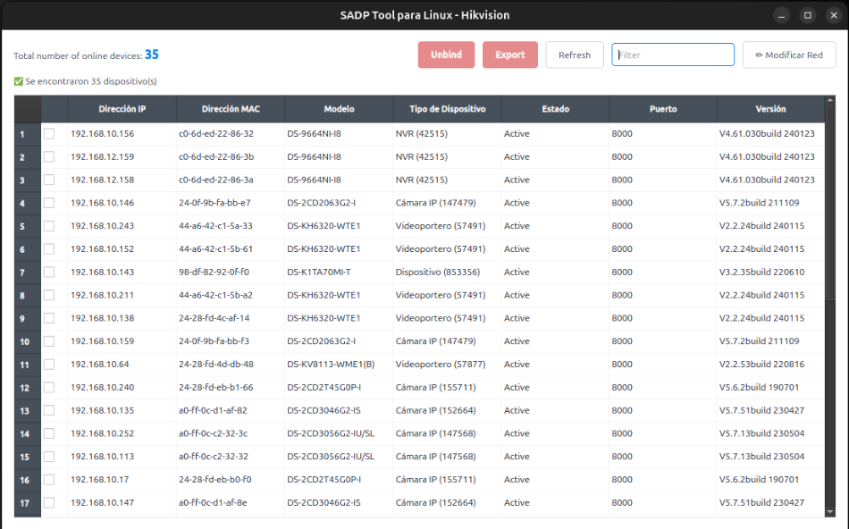

# Hikvision SADP GUI para Linux

[English](README.md) | **Español**

Aplicación gráfica nativa para Linux para el descubrimiento, diagnóstico y gestión de red de cámaras IP y dispositivos Hikvision en redes locales y subredes múltiples.

<p align="center">
  
</p>

## Instalación

```bash
bash setup-produccion.sh
```

Ejecutar sin `sudo`. El instalador solicitará privilegios de superusuario únicamente cuando sea necesario para la configuración de red y dependencias.

Para ejecutar la aplicación después de instalar:

```bash
sadp-gui
```

## Requisitos del sistema

- Ubuntu 20.04 LTS o superior (o distribuciones basadas en Debian/Ubuntu).
- Python 3.8+ con `PyQt6`.
- Go (requerido para la compilación del binario auxiliar de modificaciones de red).
- Interfaz de red activa conectada al segmento o VLAN de los dispositivos.

## Arquitectura y características técnicas

- **Motor de descubrimiento nativo (Python)**: Implementación directa del protocolo SADP vía UDP multicast (`239.255.255.250:37020`) y broadcast, enlazada directamente al puerto 37020 para garantizar la recepción de respuestas a través de reglas de firewall.
- **Soporte multi-interfaz y VLAN**: Envío de sondas en todas las interfaces de red activas de forma simultánea.
- **Soporte fuera de subred**: Detección de dispositivos sin importar si se encuentran en un segmento IP distinto al del equipo local, mediante configuración del kernel (`rp_filter=2`).
- **Traducción de tipo de dispositivo**: Identificación de códigos numéricos SADP y prefijos de modelo (`Cámara IP`, `Cámara PTZ`, `NVR`, `DVR`, `Videoportero`, `Switch PoE`).
- **Exportación CSV completa**: Generación de reportes CSV estructurados con la totalidad de atributos de red detectados (`ip`, `mac`, `tipo`, `estado`, `puerto`, `http_port`, `serial`, `version`, `subnet`, `gateway`, `dhcp`).
- **Herramienta de diagnóstico integrada**: Script `diagnostico.sh` para auditoría de sockets, reglas UFW, permisos `cap_net_raw`, capturas `tcpdump` y pruebas del protocolo.

> 🚧 **Próximas funciones (En desarrollo activo)**:
> - Modificación de parámetros de red (IP, máscara, puerta de enlace, DHCP) desde el panel lateral derecho de la aplicación.
> - Desvinculación de cuentas Hik-Connect (Unbind).

## Integración con el sistema

El instalador genera el comando global `sadp-gui` en `~/.local/bin/` y crea el archivo de escritorio `~/.local/share/applications/sadp-gui.desktop` para integración directa en el menú de aplicaciones.

## Documentación detallada

Consulte la [Guía Técnica de Uso y Red](GUIA.md) para especificaciones del protocolo, troubleshooting y configuración avanzada.

## Contribuciones y Feedback

¡Los reportes de errores, sugerencias y contribuciones son bienvenidos!
Si encuentras algún problema o tienes alguna idea de mejora, abre un *Issue* o envía un *Pull Request* en [GitHub](https://github.com/Mnxx29/Hikvision-SADP-GUI-Linux).

## Licencia

MIT License — consulte el archivo [LICENSE](LICENSE) para más detalles.
